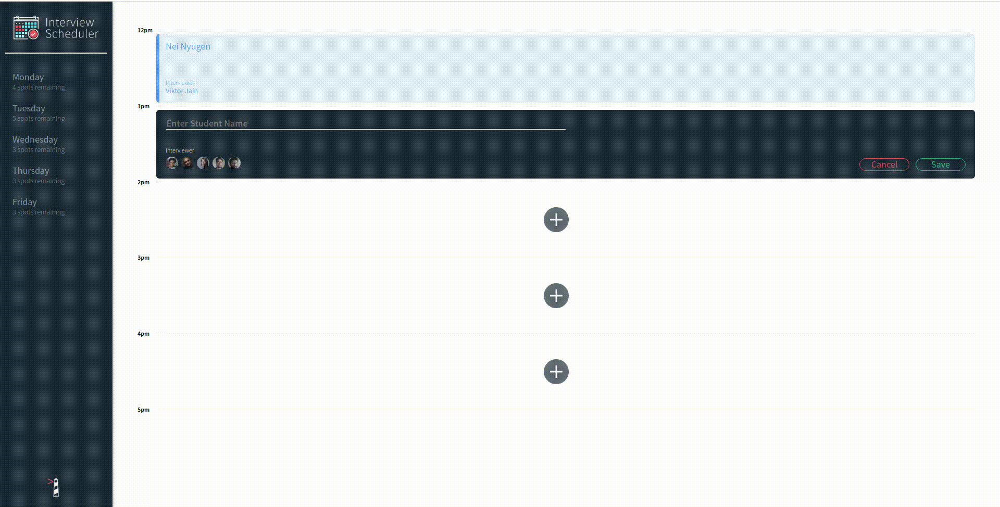

# Interview Scheduler

Interview scheduler is a simulation of a project  that 
allows a student to make appointments with a mentor.
This project works with the 
[scheduler-api ](https://github.com/Gozi1/scheduler-api) which is responsible for providing the data used.


## [Online Preview](https://ngozi-interview-scheduler.netlify.app "Interview-Scheduler's site")



### Demo
#
## Setup

Install dependencies with `npm install`.

## Running Webpack Development Server

```sh
npm start
```

## Running Jest Test Framework

```sh
npm test
```

## Running Storybook Visual Testbed

```sh
npm run storybook
```
## Dependencies

- axios
- react
- normalize-css
- classnames
- sass

## Dev-Dependencies

- storybook
- jest
- cypresss
